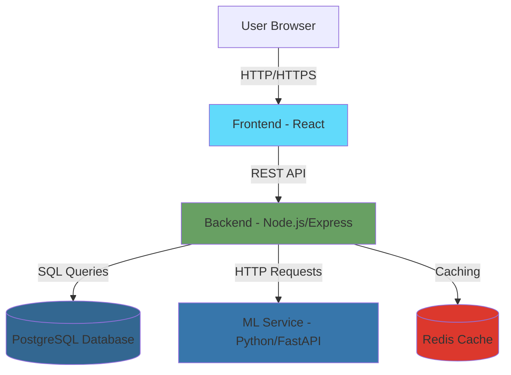
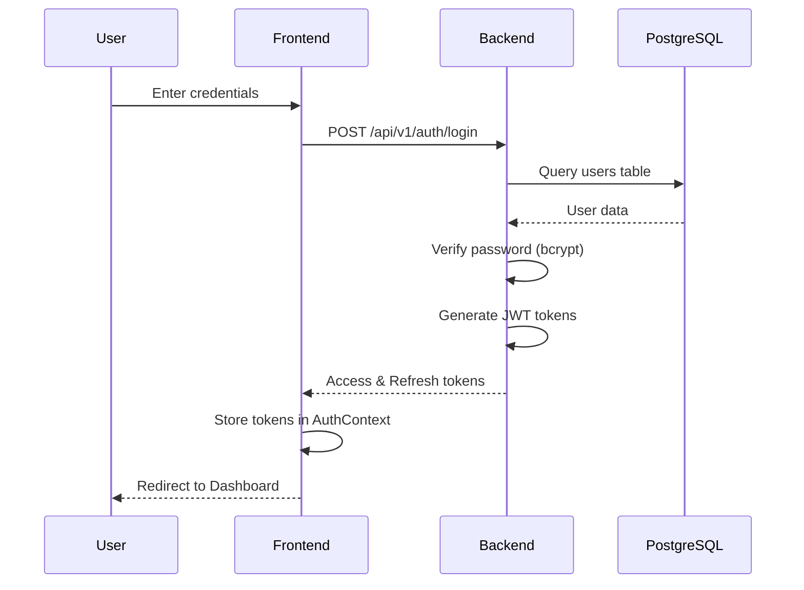
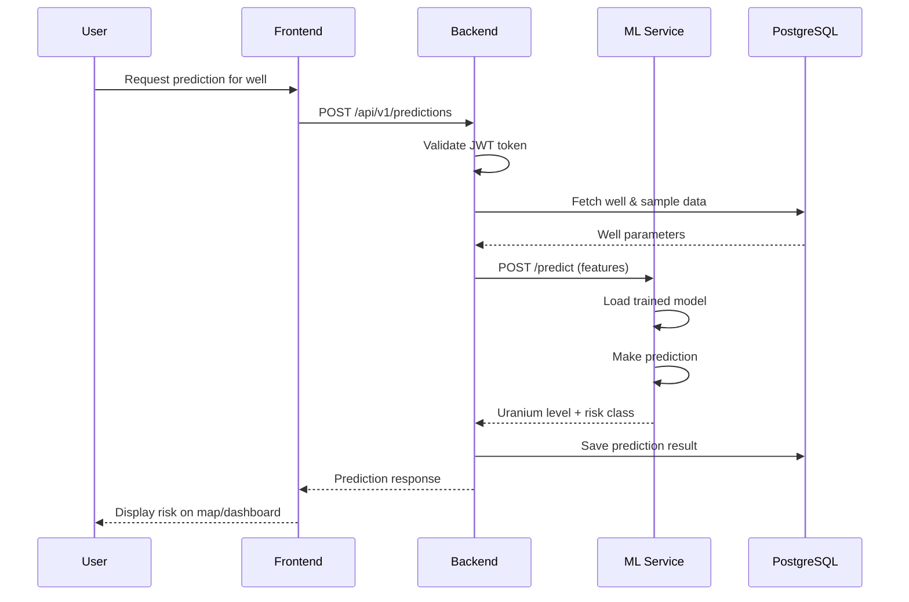
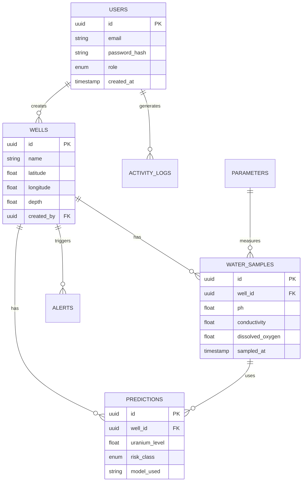

# Groundwater Platform - Complete Codebase Overview

## 🎯 Project Purpose

This is a **full-stack AI/ML platform** for predicting groundwater quality degradation and aquifer vulnerability near uranium in-situ recovery (ISR) mining sites. It uses machine learning to identify contamination risks and support smarter monitoring network design.

---

## 🏗️ Architecture Overview

Your project follows a **microservices architecture** with 3 main services:



### Service Breakdown

| Service | Technology | Port | Purpose |
|---------|-----------|------|---------|
| **Frontend** | React + TypeScript + Vite | 80 (Docker) / 5173 (Dev) | User interface |
| **Backend** | Node.js + Express + TypeScript | 5000 | REST API & Business Logic |
| **ML Service** | Python + FastAPI | 8000 | Machine Learning predictions |
| **Database** | PostgreSQL 15 | 5432 (5433 Docker) | Data persistence |
| **Cache** | Redis 7 | 6379 | Session & caching |

---

## 📂 Project Structure

```
groundwater-platform/
├── backend/              # Node.js REST API
│   ├── src/
│   │   ├── config/       # Database & environment configuration
│   │   ├── models/       # Sequelize ORM models (database tables)
│   │   ├── controllers/  # Request handlers (business logic)
│   │   ├── services/     # Service layer (complex operations)
│   │   ├── routes/       # API route definitions
│   │   ├── middleware/   # Auth, error handling, validation
│   │   ├── utils/        # Helper functions (JWT, logger)
│   │   ├── app.ts        # Express app setup
│   │   └── server.ts     # Server startup
│   └── package.json
│
├── frontend/             # React SPA
│   ├── src/
│   │   ├── components/   # Reusable UI components
│   │   ├── pages/        # Page-level components
│   │   ├── services/     # API client functions
│   │   ├── context/      # React Context (AuthContext)
│   │   ├── hooks/        # Custom React hooks
│   │   ├── routes/       # React Router setup
│   │   ├── types/        # TypeScript type definitions
│   │   ├── App.tsx       # Root component
│   │   └── main.tsx      # Entry point
│   └── package.json
│
├── ml-service/           # Python ML API
│   ├── app/
│   │   ├── core/         # ML utilities, config, schemas
│   │   │   ├── config.py         # Configuration
│   │   │   ├── schemas.py        # Pydantic models
│   │   │   ├── model_utils.py    # Prediction logic
│   │   │   ├── training.py       # Model training
│   │   │   └── preprocessing.py  # Data preprocessing
│   │   ├── data/         # Data generation scripts
│   │   ├── models/       # Trained ML models (saved files)
│   │   └── main.py       # FastAPI app
│   └── requirements.txt
│
├── infra/                # Docker configuration
│   ├── docker-compose.yml
│   ├── Dockerfile.backend
│   ├── Dockerfile.frontend
│   └── Dockerfile.ml-service
│
├── database/             # SQL migrations & seeds
└── docs/                 # Documentation
```

---

## 🔄 Data Flow & How Everything Connects

### 1. **User Authentication Flow**



**Key Files:**
- Frontend: [`LoginPage.tsx`](file:///c:/Users/letsm/OneDrive/Desktop/H2O/groundwater-platform/frontend/src/pages/LoginPage.tsx), [`AuthContext.tsx`](file:///c:/Users/letsm/OneDrive/Desktop/H2O/groundwater-platform/frontend/src/context/AuthContext.tsx)
- Backend: [`auth.routes.ts`](file:///c:/Users/letsm/OneDrive/Desktop/H2O/groundwater-platform/backend/src/routes/auth.routes.ts), [`auth.controller.ts`](file:///c:/Users/letsm/OneDrive/Desktop/H2O/groundwater-platform/backend/src/controllers/auth.controller.ts), [`auth.service.ts`](file:///c:/Users/letsm/OneDrive/Desktop/H2O/groundwater-platform/backend/src/services/auth.service.ts)

---

### 2. **ML Prediction Flow**



**Key Files:**
- Frontend: [`DashboardPage.tsx`](file:///c:/Users/letsm/OneDrive/Desktop/H2O/groundwater-platform/frontend/src/pages/DashboardPage.tsx)
- Backend: [`predictions.controller.ts`](file:///c:/Users/letsm/OneDrive/Desktop/H2O/groundwater-platform/backend/src/controllers/predictions.controller.ts), [`predictions.service.ts`](file:///c:/Users/letsm/OneDrive/Desktop/H2O/groundwater-platform/backend/src/services/predictions.service.ts)
- ML Service: [`main.py`](file:///c:/Users/letsm/OneDrive/Desktop/H2O/groundwater-platform/ml-service/app/main.py), [`model_utils.py`](file:///c:/Users/letsm/OneDrive/Desktop/H2O/groundwater-platform/ml-service/app/core/model_utils.py)

---

### 3. **Database Schema Relationships**



**Key Files:**
- Models: [`User.ts`](file:///c:/Users/letsm/OneDrive/Desktop/H2O/groundwater-platform/backend/src/models/User.ts), [`Well.ts`](file:///c:/Users/letsm/OneDrive/Desktop/H2O/groundwater-platform/backend/src/models/Well.ts), [`WaterSample.ts`](file:///c:/Users/letsm/OneDrive/Desktop/H2O/groundwater-platform/backend/src/models/WaterSample.ts), [`Prediction.ts`](file:///c:/Users/letsm/OneDrive/Desktop/H2O/groundwater-platform/backend/src/models/Prediction.ts)

---

## 🔑 Key Technologies & Concepts to Study

### **Backend Technologies**

#### 1. **Node.js & Express.js**
- **What it is:** JavaScript runtime for server-side applications
- **Why study:** Understand how the REST API handles HTTP requests
- **Key concepts:**
  - Middleware (functions that process requests)
  - Routing (mapping URLs to handlers)
  - Async/await for database operations

**Resources:**
- [Express.js Official Guide](https://expressjs.com/en/guide/routing.html)
- [Node.js Best Practices](https://github.com/goldbergyoni/nodebestpractices)

#### 2. **TypeScript**
- **What it is:** JavaScript with static typing
- **Why study:** Prevents bugs, improves code quality
- **Key concepts:**
  - Interfaces and Types
  - Generics
  - Async types (Promise<T>)

**Resources:**
- [TypeScript Handbook](https://www.typescriptlang.org/docs/handbook/intro.html)

#### 3. **Sequelize ORM**
- **What it is:** Object-Relational Mapping for PostgreSQL
- **Why study:** Understand how JavaScript objects map to database tables
- **Key concepts:**
  - Models (table definitions)
  - Associations (relationships between tables)
  - Migrations (database schema changes)

**Resources:**
- [Sequelize Documentation](https://sequelize.org/docs/v6/)

#### 4. **JWT (JSON Web Tokens)**
- **What it is:** Stateless authentication mechanism
- **Why study:** Understand how users stay logged in
- **Key concepts:**
  - Access tokens (short-lived)
  - Refresh tokens (long-lived)
  - Token verification

**Resources:**
- [JWT.io Introduction](https://jwt.io/introduction)

---

### **Frontend Technologies**

#### 5. **React**
- **What it is:** Component-based UI library
- **Why study:** Understand how the interface is built
- **Key concepts:**
  - Components (reusable UI pieces)
  - Props (passing data to components)
  - State (component data that changes)
  - Hooks (useState, useEffect, useContext)

**Resources:**
- [React Official Tutorial](https://react.dev/learn)

#### 6. **React Router**
- **What it is:** Client-side routing for SPAs
- **Why study:** Understand navigation between pages
- **Key concepts:**
  - Routes (URL to component mapping)
  - Protected routes (authentication required)
  - Navigation

**Resources:**
- [React Router Tutorial](https://reactrouter.com/en/main/start/tutorial)

#### 7. **Axios**
- **What it is:** HTTP client for API requests
- **Why study:** Understand how frontend talks to backend
- **Key concepts:**
  - GET/POST/PUT/DELETE requests
  - Request interceptors (adding auth headers)
  - Error handling

**Resources:**
- [Axios Documentation](https://axios-http.com/docs/intro)

#### 8. **Tailwind CSS**
- **What it is:** Utility-first CSS framework
- **Why study:** Understand styling approach
- **Key concepts:**
  - Utility classes (text-blue-500, p-4)
  - Responsive design (md:, lg: prefixes)

**Resources:**
- [Tailwind CSS Docs](https://tailwindcss.com/docs)

#### 9. **Leaflet & React-Leaflet**
- **What it is:** Interactive map library
- **Why study:** Understand geospatial visualization
- **Key concepts:**
  - Map tiles
  - Markers (well locations)
  - Popups (well information)

**Resources:**
- [React-Leaflet Documentation](https://react-leaflet.js.org/)

---

### **ML Service Technologies**

#### 10. **FastAPI**
- **What it is:** Modern Python web framework
- **Why study:** Understand ML service API
- **Key concepts:**
  - Path operations (routes)
  - Pydantic models (request/response validation)
  - Async endpoints

**Resources:**
- [FastAPI Tutorial](https://fastapi.tiangolo.com/tutorial/)

#### 11. **scikit-learn**
- **What it is:** Machine learning library
- **Why study:** Understand model training
- **Key concepts:**
  - RandomForest (ensemble learning)
  - Train/test split
  - Model evaluation (RMSE, R²)

**Resources:**
- [scikit-learn User Guide](https://scikit-learn.org/stable/user_guide.html)

#### 12. **XGBoost**
- **What it is:** Gradient boosting library
- **Why study:** Understand advanced ML algorithms
- **Key concepts:**
  - Gradient boosting
  - Feature importance
  - Hyperparameter tuning

**Resources:**
- [XGBoost Documentation](https://xgboost.readthedocs.io/)

#### 13. **Pydantic**
- **What it is:** Data validation using Python type hints
- **Why study:** Understand request/response schemas
- **Key concepts:**
  - BaseModel classes
  - Validation
  - Serialization

**Resources:**
- [Pydantic Documentation](https://docs.pydantic.dev/)

---

### **DevOps & Infrastructure**

#### 14. **Docker & Docker Compose**
- **What it is:** Containerization platform
- **Why study:** Understand deployment
- **Key concepts:**
  - Containers (isolated environments)
  - Images (container templates)
  - docker-compose.yml (multi-service orchestration)
  - Volumes (persistent data)
  - Networks (service communication)

**Resources:**
- [Docker Get Started](https://docs.docker.com/get-started/)

#### 15. **PostgreSQL**
- **What it is:** Relational database
- **Why study:** Understand data storage
- **Key concepts:**
  - Tables, rows, columns
  - Primary/foreign keys
  - Indexes
  - Transactions

**Resources:**
- [PostgreSQL Tutorial](https://www.postgresqltutorial.com/)

#### 16. **Redis**
- **What it is:** In-memory data store
- **Why study:** Understand caching
- **Key concepts:**
  - Key-value storage
  - Session management
  - Job queues (Bull)

**Resources:**
- [Redis Documentation](https://redis.io/docs/)

---

## 🔐 Authentication & Authorization

### Role-Based Access Control (RBAC)

| Role | Permissions |
|------|-------------|
| **Admin** | Full access: manage users, wells, samples, predictions |
| **Analyst** | Create wells, samples, run predictions |
| **Viewer** | Read-only access to dashboards |

**Implementation:**
1. User logs in → Backend generates JWT with role
2. Frontend stores JWT in AuthContext
3. Each API request includes JWT in Authorization header
4. Backend middleware verifies JWT and checks role
5. Route handlers enforce permissions

**Key Files:**
- [`authMiddleware.ts`](file:///c:/Users/letsm/OneDrive/Desktop/H2O/groundwater-platform/backend/src/middleware/authMiddleware.ts) - Verifies JWT
- [`roleMiddleware.ts`](file:///c:/Users/letsm/OneDrive/Desktop/H2O/groundwater-platform/backend/src/middleware/roleMiddleware.ts) - Checks user role

---

## 🤖 Machine Learning Pipeline

### Training Process

1. **Data Generation** ([`generate_synthetic_data.py`](file:///c:/Users/letsm/OneDrive/Desktop/H2O/groundwater-platform/ml-service/app/data/generate_synthetic_data.py))
   - Creates 1000 synthetic samples
   - Features: distance, depth, pH, conductivity, dissolved oxygen, temperature
   - Target: uranium concentration

2. **Model Training** ([`training.py`](file:///c:/Users/letsm/OneDrive/Desktop/H2O/groundwater-platform/ml-service/app/core/training.py))
   - Trains RandomForest (100 trees)
   - Trains XGBoost
   - Evaluates both models
   - Saves best model

3. **Prediction** ([`model_utils.py`](file:///c:/Users/letsm/OneDrive/Desktop/H2O/groundwater-platform/ml-service/app/core/model_utils.py))
   - Loads trained model
   - Preprocesses input features
   - Predicts uranium level
   - Classifies risk (LOW/MEDIUM/HIGH/VERY_HIGH)

### Risk Classification

```python
if uranium < 15:    risk = "LOW"
elif uranium < 30:  risk = "MEDIUM"  # WHO guideline
elif uranium < 60:  risk = "HIGH"
else:               risk = "VERY_HIGH"
```

---

## 📡 API Endpoints Reference

### Authentication
- `POST /api/v1/auth/register` - Create new user
- `POST /api/v1/auth/login` - Login (returns JWT)
- `POST /api/v1/auth/refresh` - Refresh access token
- `GET /api/v1/auth/me` - Get current user info

### Wells
- `GET /api/v1/wells` - List all wells (with filters)
- `POST /api/v1/wells` - Create well (Admin/Analyst)
- `GET /api/v1/wells/:id` - Get well details
- `PUT /api/v1/wells/:id` - Update well
- `DELETE /api/v1/wells/:id` - Delete well (Admin)
- `GET /api/v1/wells/map` - Get wells for map view

### Water Samples
- `GET /api/v1/wells/:wellId/samples` - Get samples for well
- `POST /api/v1/wells/:wellId/samples` - Add sample
- `GET /api/v1/samples/:id` - Get sample details
- `DELETE /api/v1/samples/:id` - Delete sample

### Predictions
- `POST /api/v1/predictions` - Create prediction
- `GET /api/v1/wells/:wellId/predictions` - Get predictions for well
- `GET /api/v1/predictions/summary` - Get risk statistics

### ML Service
- `POST /ml/train` - Train models
- `POST /ml/predict` - Make prediction
- `GET /ml/health` - Health check
- `GET /ml/models/info` - Model information

---

## 🚀 Development Workflow

### Running Locally (Manual)

1. **Start PostgreSQL** (port 5432)
2. **Start Redis** (port 6379)
3. **Backend:**
   ```bash
   cd backend
   npm install
   npm run dev  # Runs on port 5000
   ```
4. **ML Service:**
   ```bash
   cd ml-service
   python -m venv venv
   venv\Scripts\activate
   pip install -r requirements.txt
   python -m app.data.generate_synthetic_data  # Generate training data
   uvicorn app.main:app --reload  # Runs on port 8000
   ```
5. **Frontend:**
   ```bash
   cd frontend
   npm install
   npm run dev  # Runs on port 5173
   ```

### Running with Docker

```bash
cd infra
docker-compose up -d
```

All services start automatically with health checks!

---

## 🎓 Learning Path Recommendations

### Beginner (Start Here)
1. **JavaScript/TypeScript basics**
2. **React fundamentals** (components, props, state)
3. **REST API concepts** (HTTP methods, status codes)
4. **SQL basics** (SELECT, INSERT, UPDATE, DELETE)

### Intermediate
5. **Express.js** (routing, middleware)
6. **React Router** (navigation)
7. **JWT authentication**
8. **Sequelize ORM**
9. **Docker basics**

### Advanced
10. **Machine Learning** (scikit-learn, XGBoost)
11. **FastAPI** (async Python web framework)
12. **PostgreSQL optimization**
13. **Redis caching strategies**
14. **Microservices architecture**

---

## 🔍 Common Debugging Points

### Backend Issues
- **Database connection errors:** Check `.env` file for correct credentials
- **JWT errors:** Ensure JWT_SECRET is set
- **CORS errors:** Verify CORS_ORIGIN in `.env`

### Frontend Issues
- **API connection errors:** Check VITE_API_URL in environment
- **Authentication loops:** Clear localStorage and cookies
- **Map not loading:** Ensure Leaflet CSS is imported

### ML Service Issues
- **Models not found:** Run `/train` endpoint first
- **Prediction errors:** Verify all required features are provided
- **Import errors:** Check Python virtual environment is activated

---

## 📚 Additional Resources

- **Full-Stack Development:** [The Odin Project](https://www.theodinproject.com/)
- **REST API Design:** [REST API Tutorial](https://restfulapi.net/)
- **Machine Learning:** [Andrew Ng's ML Course](https://www.coursera.org/learn/machine-learning)
- **Docker:** [Docker Curriculum](https://docker-curriculum.com/)

---

## 🎯 Next Steps

1. **Explore the codebase:** Start with [`README.md`](file:///c:/Users/letsm/OneDrive/Desktop/H2O/groundwater-platform/README.md)
2. **Run the application:** Use Docker Compose for easiest setup
3. **Study key files:** Focus on the files mentioned in this document
4. **Make small changes:** Try adding a new API endpoint or UI component
5. **Read documentation:** Follow the resource links above

Good luck with your learning journey! 🚀
