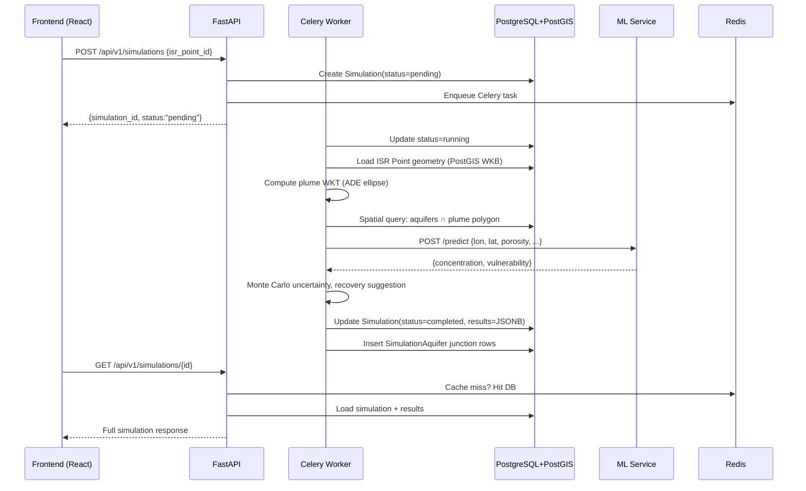

# JalDrishti — Full-Stack Architecture Analysis

## Overview

**JalDrishti** is a **Groundwater Contamination ISR (In-Situ Recovery) Impact Assessment Platform**. It models how uranium/contaminant plumes propagate through aquifer systems from ISR mining injection points (ISR Points), supporting spatial queries, async physics simulations, ML-based predictions, and role-based access control (RBAC).

---

## 1. Project-Level Structure

```
JalDrishti/
├── backend/          # Python FastAPI service
├── frontend/         # React + TypeScript SPA
└── docker-compose.yml
```

The [docker-compose.yml](file:///c:/Users/letsm/OneDrive/Desktop/JalDrishti/docker-compose.yml) orchestrates **six services**:

| Service | Image / Build | Port | Role |
|---|---|---|---|
| [db](file:///c:/Users/letsm/OneDrive/Desktop/JalDrishti/backend/app/database.py#25-36) | `postgis/postgis:16-3.4` | 5432 | PostgreSQL with PostGIS spatial extension |
| [redis](file:///c:/Users/letsm/OneDrive/Desktop/JalDrishti/backend/app/cache.py#11-20) | `redis:7-alpine` | 6379 | Cache (DB 0) + Celery broker (DB 1) + results (DB 2) |
| `backend` | [./backend/Dockerfile](file:///c:/Users/letsm/OneDrive/Desktop/JalDrishti/backend/Dockerfile) | 8000 | FastAPI REST API |
| `celery-worker` | [./backend/Dockerfile](file:///c:/Users/letsm/OneDrive/Desktop/JalDrishti/backend/Dockerfile) | — | Async task worker |
| `flower` | [./backend/Dockerfile](file:///c:/Users/letsm/OneDrive/Desktop/JalDrishti/backend/Dockerfile) | 5555 | Celery monitoring dashboard |
| `ml-service` | `./ml-service/Dockerfile` | 8001 | ML microservice (separate container) |

---

## 2. Backend Architecture

### 2.1 Technology Stack

| Layer | Technology |
|---|---|
| Framework | FastAPI (async) |
| ORM | SQLAlchemy 2.x (async, mapped columns) |
| Database | PostgreSQL 16 + PostGIS 3.4 + GeoAlchemy2 |
| Migrations | Alembic |
| Auth | JWT (HS256) — access + refresh tokens |
| Caching | Redis (async, `redis.asyncio`) |
| Task Queue | Celery + Redis broker |
| ML Integration | HTTP call via `httpx` to separate ML service |
| Monitoring | Prometheus, Sentry (optional) |
| Rate Limiting | `slowapi` |
| Logging | `loguru` |

### 2.2 Folder Structure

```
backend/app/
├── main.py            # App factory, middleware, global error handlers
├── config.py          # Pydantic Settings (env-driven config)
├── database.py        # Async SQLAlchemy engine + session factory
├── dependencies.py    # FastAPI DI: get_current_user, RBAC roles
├── exceptions.py      # Custom app exceptions (AppException hierarchy)
├── cache.py           # Redis async wrapper (get/set/delete/invalidate)
├── celery_app.py      # Celery instance configuration
├── api/
│   ├── router.py      # Aggregates all v1 routers under /api/v1
│   └── v1/
│       ├── auth.py         # POST /auth/token, /auth/refresh, /auth/me
│       ├── users.py        # User CRUD
│       ├── districts.py    # Districts CRUD + geospatial queries
│       ├── blocks.py       # Administrative blocks CRUD
│       ├── aquifers.py     # Aquifer CRUD + spatial attributes
│       ├── isr_points.py   # ISR injection point management
│       ├── simulations.py  # Trigger & fetch simulation results
│       └── ingest.py       # Bulk data ingestion endpoint
├── models/             # SQLAlchemy ORM models (one file per entity)
├── repositories/       # Data access objects (thin DB layer)
├── services/           # Business logic layer
├── schemas/            # Pydantic request/response schemas
└── tasks/              # Celery task definitions
```

### 2.3 Layered Architecture (Backend)

```
Request
  │
  ▼
FastAPI Router (api/v1/*.py)
  │  → DI: get_db (AsyncSession), get_current_user, require_roles
  │
  ▼
Service Layer (services/*.py)
  │  → Orchestrates business rules, calls repositories, ML service
  │
  ▼
Repository Layer (repositories/*.py)
  │  → SQL queries via SQLAlchemy async session
  │
  ▼
PostgreSQL + PostGIS (models/*.py define schema)
```

This is a clean **Router → Service → Repository** pattern — a standard layered architecture.

### 2.4 Data Models

All models inherit from `UUIDPrimaryKeyMixin` and `TimestampMixin` (from [models/base.py](file:///c:/Users/letsm/OneDrive/Desktop/JalDrishti/backend/app/models/base.py)), giving every entity a UUID primary key and `created_at`/`updated_at` timestamps.

| Model | Key Fields | Relationships |
|---|---|---|
| [User](file:///c:/Users/letsm/OneDrive/Desktop/JalDrishti/backend/app/models/user.py#19-30) | username, email, hashed_password, role (admin/analyst/viewer) | — |
| `District` | name, geometry (MULTIPOLYGON, SRID 4326) | → blocks |
| `Block` | name, district_id, geometry | → aquifers |
| [Aquifer](file:///c:/Users/letsm/OneDrive/Desktop/JalDrishti/backend/app/models/aquifer.py#28-75) | name, type (12 enum values), geometry (MULTIPOLYGON), porosity, hydraulic_conductivity, transmissivity | → hydraulic_heads, monitoring_data |
| `IsrPoint` | location (POINT), injection_rate | → simulations |
| [Simulation](file:///c:/Users/letsm/OneDrive/Desktop/JalDrishti/backend/app/models/simulation.py#24-58) | status (pending/running/completed/failed), affected_area, vulnerability JSONB, concentration JSONB, task_id | → isr_point, impacted_aquifers (M2M), plume_parameters |
| [PlumeParameter](file:///c:/Users/letsm/OneDrive/Desktop/JalDrishti/backend/app/models/simulation.py#60-73) | dispersivity_l/t, retardation_factor, decay_constant | → simulation |
| [SimulationAquifer](file:///c:/Users/letsm/OneDrive/Desktop/JalDrishti/backend/app/models/simulation.py#12-22) | junction table (simulation_id ↔ aquifer_id) | — |
| `HydraulicHead` | head value, measurement date, aquifer_id | — |
| `MonitoringData` | water quality parameters, aquifer_id | — |
| `MlModel` | model name, version, metrics | — |

**Spatial indices** use `postgresql_using="gist"` for geometry columns, enabling fast spatial queries.

### 2.5 Authentication & RBAC

- **JWT access tokens** (15-minute expiry) + **refresh tokens** (7-day expiry)
- [dependencies.py](file:///c:/Users/letsm/OneDrive/Desktop/JalDrishti/backend/app/dependencies.py) provides [get_current_user](file:///c:/Users/letsm/OneDrive/Desktop/JalDrishti/backend/app/dependencies.py#14-27) (validates Bearer token) and [require_roles(*roles)](file:///c:/Users/letsm/OneDrive/Desktop/JalDrishti/backend/app/dependencies.py#29-39) — a dependency factory that returns a 403 if the user's role doesn't match
- Three roles: `admin > analyst > viewer`
- Route-level example: ISR points restricted to `admin` + `analyst`; simulations readable by all roles

### 2.6 Simulation Workflow (Core Domain Logic)

This is the most complex part of the system. [services/simulation.py](file:///c:/Users/letsm/OneDrive/Desktop/JalDrishti/backend/app/services/simulation.py) orchestrates a 9-step pipeline — designed to run inside a Celery worker:

```
1. Extract ISR Point's lon/lat (from PostGIS WKB geometry, via Shapely)
2. Compute gradient angle (stub: random NE angle, should be from piezometric data)
3. Compute plume geometry using Advection-Dispersion Equation (ADE):
   - Approximates plume as an ellipse polygon (36-point WKT)
   - rx = dispersivity_L × √days, ry = dispersivity_T × √days
4. Spatial query: find aquifers intersecting the plume polygon
5. Call ML microservice (POST /predict) with concentration inputs
   - Falls back to realistic stub values if ML service is unreachable
6. Compute affected area (π × rx × ry)
7. Monte Carlo uncertainty estimate (100 runs, Gaussian noise model)
8. Recovery suggestion based on average aquifer porosity
9. Persist results back to Simulation record + create SimulationAquifer junctions
```

### 2.7 Caching Strategy

[cache.py](file:///c:/Users/letsm/OneDrive/Desktop/JalDrishti/backend/app/cache.py) provides a thin Redis wrapper:
- [cache_get(key)](file:///c:/Users/letsm/OneDrive/Desktop/JalDrishti/backend/app/cache.py#22-30) / [cache_set(key, value, ttl)](file:///c:/Users/letsm/OneDrive/Desktop/JalDrishti/backend/app/cache.py#32-38) / [cache_delete(key)](file:///c:/Users/letsm/OneDrive/Desktop/JalDrishti/backend/app/cache.py#40-46)
- [cache_invalidate_pattern(pattern)](file:///c:/Users/letsm/OneDrive/Desktop/JalDrishti/backend/app/cache.py#48-57) — for bulk invalidation (e.g., `district:*`)
- Default TTL: 3600 seconds
- Used in district/aquifer list endpoints to avoid repeated heavy spatial queries

---

## 3. Frontend Architecture

### 3.1 Technology Stack

| Layer | Technology |
|---|---|
| Framework | React 18 + TypeScript |
| Build tool | Vite |
| UI Library | Material UI (MUI v5) + custom [theme.ts](file:///c:/Users/letsm/OneDrive/Desktop/JalDrishti/frontend/src/theme.ts) |
| Routing | React Router DOM v6 |
| Global State | Redux Toolkit (3 slices) |
| Server State | TanStack React Query (5-min stale, 10-min GC) |
| HTTP | Axios with request/response interceptors |
| CSS | Tailwind CSS + MUI (dual CSS system) |

### 3.2 Folder Structure

```
frontend/src/
├── main.tsx            # React root: wraps app in Redux + React Query + StrictMode
├── App.tsx             # BrowserRouter + MUI ThemeProvider + AppRoutes
├── theme.ts            # Custom MUI theme
├── index.css           # Global styles
├── api/
│   ├── axiosInstance.ts    # Configured Axios: auth headers, token refresh logic
│   ├── authApi.ts          # Login, refresh, me endpoints
│   ├── districtsApi.ts     # Districts + nested blocks API calls
│   ├── aquifersApi.ts      # Aquifer CRUD calls
│   ├── isrApi.ts           # ISR Points CRUD calls
│   └── simulationsApi.ts   # Trigger & fetch simulation calls
├── redux/
│   ├── store.ts            # Redux store: auth + simulations + ui slices
│   └── slices/
│       ├── authSlice.ts    # Access/refresh tokens, user info, login state
│       ├── simulationsSlice.ts  # Active simulation tracking
│       └── uiSlice.ts      # Modals, drawers, loading states
├── routes/
│   ├── AppRoutes.tsx       # Route definitions (lazy loaded, protected)
│   └── ProtectedRoute.tsx  # Auth guard + role guard
├── components/
│   ├── common/             # LoadingSpinner, ErrorBoundary, etc.
│   ├── forms/              # Reusable form components
│   ├── geospatial/         # Map components (Leaflet/MapLibre)
│   └── layout/             # MainLayout, Sidebar, Navbar
├── pages/
│   ├── LoginPage.tsx
│   ├── DashboardPage.tsx
│   ├── DistrictsPage.tsx
│   ├── AquifersPage.tsx
│   ├── IsrPointsPage.tsx
│   └── SimulationDetailPage.tsx
├── hooks/                  # Custom React hooks
├── services/               # Frontend service utilities
├── context/ & contexts/    # React Context providers (supplementary)
├── types/                  # TypeScript type definitions
├── utils/                  # Utility functions
└── websocket/              # WebSocket client (real-time simulation updates)
```

### 3.3 State Management Strategy

**Two-tier state management** is used:

| Store | What it manages |
|---|---|
| **Redux (auth)** | Access token, refresh token, current user — must survive across route changes and be accessible outside React tree (in `axiosInstance`) |
| **Redux (simulations)** | In-progress simulation IDs for polling or WS tracking |
| **Redux (ui)** | Global UI state: modals open/closed, drawer state |
| **React Query** | All server data: districts, aquifers, ISR points, simulation results — with automatic caching, background refetching |

### 3.4 HTTP & Auth Flow

[axiosInstance.ts](file:///c:/Users/letsm/OneDrive/Desktop/JalDrishti/frontend/src/api/axiosInstance.ts) implements a production-grade auth pattern:

```
1. Request interceptor: attaches Bearer token from Redux store
2. Response interceptor:
   - On 401: attempts token refresh via POST /auth/refresh
   - While refreshing: queues all concurrent requests
   - On refresh success: replays all queued requests with new token
   - On refresh failure: dispatches logout(), redirects to /login
```

### 3.5 Routing & Authorization

```
/login                         → public
/dashboard                     → ProtectedRoute (any authenticated user)
/districts                     → ProtectedRoute (any role)
/aquifers                      → ProtectedRoute (any role)
/simulations/:id               → ProtectedRoute (any role)
/isr-points                    → ProtectedRoute (admin + analyst only)
```

All pages are **lazy-loaded** (`React.lazy`) for code splitting. `ProtectedRoute` checks the Redux auth slice; if `allowedRoles` prop is given, it also enforces role-level access.

---

## 4. Data Flow (End-to-End Example: Running a Simulation)



---

## 5. Design Patterns & Conventions

| Pattern | Where Used |
|---|---|
| **Repository Pattern** | `repositories/*.py` — all DB access isolated from business logic |
| **Service Layer** | `services/*.py` — domain logic decoupled from HTTP layer |
| **Dependency Injection** | FastAPI's `Depends()` for DB session, current user, role checks |
| **Factory Function** | [create_app()](file:///c:/Users/letsm/OneDrive/Desktop/JalDrishti/backend/app/main.py#46-109) in [main.py](file:///c:/Users/letsm/OneDrive/Desktop/JalDrishti/backend/app/main.py) creates the FastAPI instance (testable) |
| **Cached Settings** | `@lru_cache()` on [get_settings()](file:///c:/Users/letsm/OneDrive/Desktop/JalDrishti/backend/app/config.py#62-65) — singleton config object |
| **Interceptor Pattern** | Axios interceptors for token injection + silent refresh |
| **Lazy Loading** | `React.lazy()` on all pages for code splitting |
| **Slice Pattern** | Redux Toolkit slices (auth, simulations, ui) |
| **Stub/Fallback** | ML service has full fallback to realistic stubs — resilient design |
| **RBAC via DI** | [require_roles()](file:///c:/Users/letsm/OneDrive/Desktop/JalDrishti/backend/app/dependencies.py#29-39) factory returns a reusable FastAPI dependency |
| **Optimistic Spatial Index** | GiST index on all geometry columns for fast spatial queries |
| **Two-phase Commit Guard** | [get_db()](file:///c:/Users/letsm/OneDrive/Desktop/JalDrishti/backend/app/database.py#25-36) always commits on success, rolls back on exception |

---

## 6. Architectural Strengths

- ✅ **Async all the way** — FastAPI + asyncpg + asyncio = high concurrency
- ✅ **Clear layering** — Router → Service → Repository prevents spaghetti code
- ✅ **Spatial-first design** — PostGIS + GeoAlchemy2 + GiST indices built in from the ground up
- ✅ **Resilient ML integration** — graceful fallback stubs; simulation never hard-fails on ML unavailability
- ✅ **Production-grade auth** — token refresh queue pattern prevents duplicate refresh calls under concurrent load
- ✅ **Dual caching** — React Query (client) + Redis (server) reduces DB load significantly
- ✅ **Observable system** — Prometheus metrics, Sentry, Celery Flower, loguru structured logging all wired up
- ✅ **Role-enforced at two layers** — backend RBAC ([require_roles](file:///c:/Users/letsm/OneDrive/Desktop/JalDrishti/backend/app/dependencies.py#29-39)) + frontend route guards (`ProtectedRoute`)

---

## 7. Architectural Weaknesses & Gaps

> [!WARNING]
> **Hardcoded credentials in config.py** — `DB_PASSWORD = "040812"` and `JWT_SECRET = "change-this-secret"` are committed defaults. These must be overridden via [.env](file:///c:/Users/letsm/OneDrive/Desktop/JalDrishti/backend/.env) in every deployment, but the defaults being weak/secret in source code is a security risk.

> [!CAUTION]
> **Simulation physics are stubs** — The gradient angle is randomly generated (`random.uniform(30, 90)`), and lon/lat falls back to a hardcoded Jharkhand centroid (`85.3, 23.5`) if geometry parsing fails. The simulation results are not scientifically reliable until real piezometric data and proper ADE solver are integrated.

- ⚠️ **`context/` and `contexts/` both exist** — two separate context directories suggest leftover refactoring; could cause import confusion
- ⚠️ **[tsc_errors.txt](file:///c:/Users/letsm/OneDrive/Desktop/JalDrishti/frontend/tsc_errors.txt) committed** — TypeScript errors present in the frontend codebase; signals incomplete type coverage
- ⚠️ **No rate limiting on Celery task enqueue** — a user could spam `POST /simulations` and queue thousands of tasks
- ⚠️ **ML service directory not present** — [docker-compose.yml](file:///c:/Users/letsm/OneDrive/Desktop/JalDrishti/docker-compose.yml) references `./ml-service/` but that directory doesn't exist in the repo, making `docker-compose up` fail for the full stack
- ⚠️ **[cache_invalidate_pattern](file:///c:/Users/letsm/OneDrive/Desktop/JalDrishti/backend/app/cache.py#48-57) uses `KEYS` command** — Redis `KEYS` is O(N) and blocks the server; should use `SCAN` for production workloads
- ⚠️ **No WebSocket security** — the `websocket/` directory exists on the frontend but WS auth is not documented in the backend API routes
- ⚠️ **Dual CSS systems** — both Tailwind CSS and MUI are configured simultaneously; this increases bundle size and can create styling conflicts

---

## 8. Infrastructure Topology Summary

```
Browser
  ↕ HTTP (Vite proxy /api/v1 → localhost:8000)
  
FastAPI (port 8000)
  ├── PostgreSQL+PostGIS (port 5432)  ← primary data store
  ├── Redis (port 6379, DB 0)         ← response cache
  ├── Redis (DB 1)                    ← Celery task broker
  └── httpx → ML Service (port 8001) ← predictions

Celery Worker (separate process, same codebase)
  ├── Redis (DB 1)                    ← receives tasks
  ├── Redis (DB 2)                    ← stores results
  ├── PostgreSQL                      ← persists simulation output
  └── httpx → ML Service             ← prediction calls

Flower (port 5555) ← Celery monitoring UI
```
